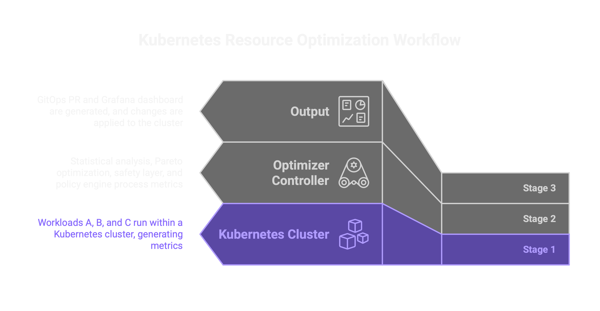

# Intelligent Cluster Optimizer

> **Most Kubernetes clusters waste 50–70% of their resources — or crash under load because they're under-provisioned.**
> Existing autoscalers react to single metrics. They don't forecast, don't optimize across trade-offs, and don't protect against unsafe changes.
> We built something different.

---

## What Makes This Different

**↻ Predict, don't react**
Most autoscalers respond to what's happening now. We model what's coming next — using Holt-Winters forecasting, trend decomposition, and learned workload patterns to size resources before demand spikes.

**⚖ Optimize across trade-offs, not just one metric**
Cost, performance, and reliability pull in different directions. We find the Pareto-optimal frontier — solutions where improving one objective doesn't silently hurt another.

**🛡 Safety is not optional**
Every recommendation passes through circuit breakers, SLA monitors, HPA conflict checks, and automatic rollback triggers. If something goes wrong, the system catches it before it reaches production.

**📋 Recommendations you can review**
We don't silently apply changes. We generate GitOps pull requests — auditable, version-controlled, and mergeable on your terms.

---

---

## Stack

---

## Repositories

| | |
|---|---|
| [`intelligent-cluster-optimizer`](https://github.com/k8s-resource-optimizer/intelligent-cluster-optimizer) | Controller, optimizer engine, safety layer, GitOps integration, monitoring |
| [`optimizer-test`](https://github.com/k8s-resource-optimizer/optimizer-test) | 600+ unit, integration, and E2E tests |

---

**Developers** · [Azra Karakaya](https://github.com/azrakarakaya1) · [Erva Şengül](https://github.com/ervasengul)
